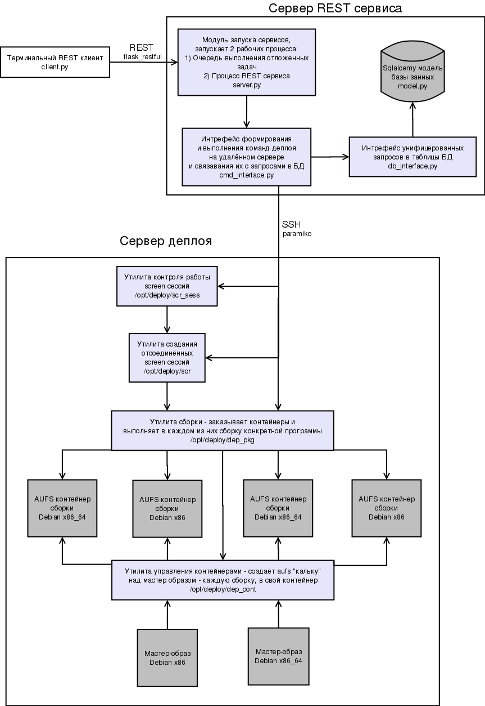
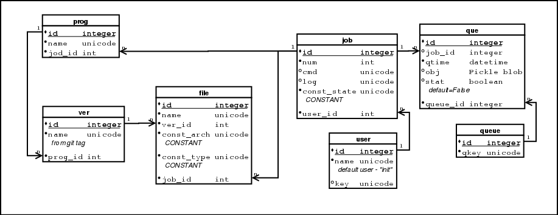

Deploy сервер для Debian c REST WEB сервисом и клиентом
=======================================================

Описание комплекса:
-------------------

**Комплекс состоит из 3 частей:**

1) Сервер деплоя
----------------
*(см: deploy_server)*

Утилиты этого уровня написаны на bash чтобы не привязывать в качестве зависимостей к деплой серверам наличие python инфраструктуры - bash с задачами данного уровня прекрасно справляется.
Одна утилита деплой сервера(dep_cont) создают индивидуальные среды-контейнеры сборки для разных программ на основании мастер образа. Другая (dep_pkg) производит саму сборку внутри отдельного взятого контейнера. Утилиты управляются из командной строки и могут также использоваться для сборки отдельно от REST сервиса. Блокировками они управляют уже на этом уровне.

2) REST сервис на python
------------------------
*(см: web_service/deploy_rest_server, пакет: web_service/dist/web_service.tar.gz)*

Составит из нескольких частей:

1.  Модуль управления процессами(server.py) - запускает 2 процесса: очередь отложенных операций(имеются ввиду операции выполняющие блокировки - сборка и удаление) и собственно сам REST сервис реализованный на flask_restful.
2.  Командный интерфейс(cmd_interface.py) - выполняет по ssh (через paramiko) утилиты деплой сервера и фиксирует результаты в БД
3.  Интерфейс унификации запросов в БД (db_interface.py) - абстракция для обработки запросов командного интерфейса в синтаксис sqlalchemy
4.  Модель БД для sqlalchemy

3) Консольный клиент для REST сервиса
-------------------------------------
*(см:  client/deploy_rest_client,пакет: client/dist/client.tar.gz)*

Реализован на python, запросы осуществляет посредством requests, параметры командной строки парсит через opster.
Есть русская локализация через gettext.

Дистрибьюция
------------

Клиент и Сервис имеют в архиве каталог dist - в нем собранные при помощи cx_freezee пакеты данных программ.
При таком методе дистрибюции можно не тащить на сервера всю python инфраструктуру запуска приложения - она статично связанны с ним в пакете. 
